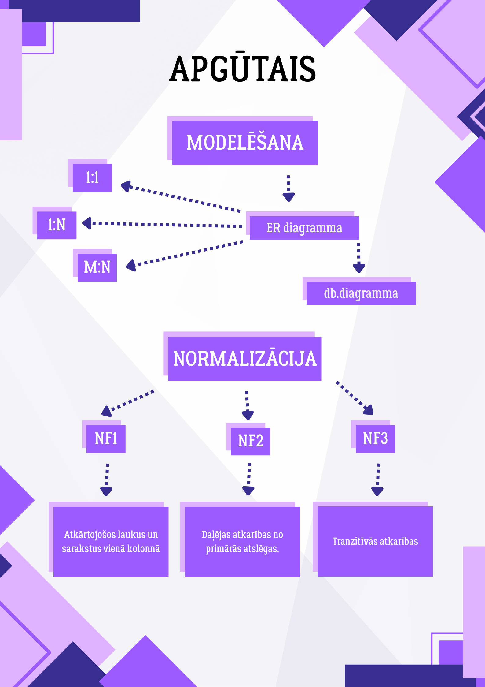

# Datubāzu modelēšana un normalizācija

  

Šis repozitorijs satur mācību materiālus par datubāzu projektēšanu, ER diagrammām un datu normalizāciju (1NF - 3NF).

---

## Materiālu struktūra

### 1. Teorija
* **[Datubāzu modelēšana un normalizācija (1).pdf](./Datubāzu%20modelēšana%20un%20normalizācija%20(1).pdf)**
    * ER diagrammu pamati.
    * Normalizācijas soļi un noteikumi.

### 2. Praktiskais kods
* **[db students.docx](./db%20students.docx)**
    * SQL skripti tabulu izveidei (`CREATE TABLE`) un datu aizpildei.
    * PHP piemērs datu atlasei no datubāzes.

### 3. Praktiskie uzdevumi
* **[Uzdevumi_normalizācija.xlsx](./Uzdevumi_normalizācija.xlsx)**
    * 7 interaktīvi uzdevumi Excel vidē datu transformēšanai.

---

## Uzstādīšana un lietošana

Lai palaistu praktisko daļu (SQL/PHP):
1.  Lejupielādējiet un palaidiet **WAMP** serveri.
2.  Importējiet SQL kodu no Word faila savā `phpMyAdmin` vidē.
3.  Pārliecinieties, ka PHP skripts ir ievietots jūsu servera `www` vai `htdocs` mapē.

---

## Refleksija
Nodarbības beigās studenti tiek aicināti aizpildīt refleksijas karti:

---
*Materiālus sagatavoja: Daniels Mēters un Sofia Lucenko (2026)*
